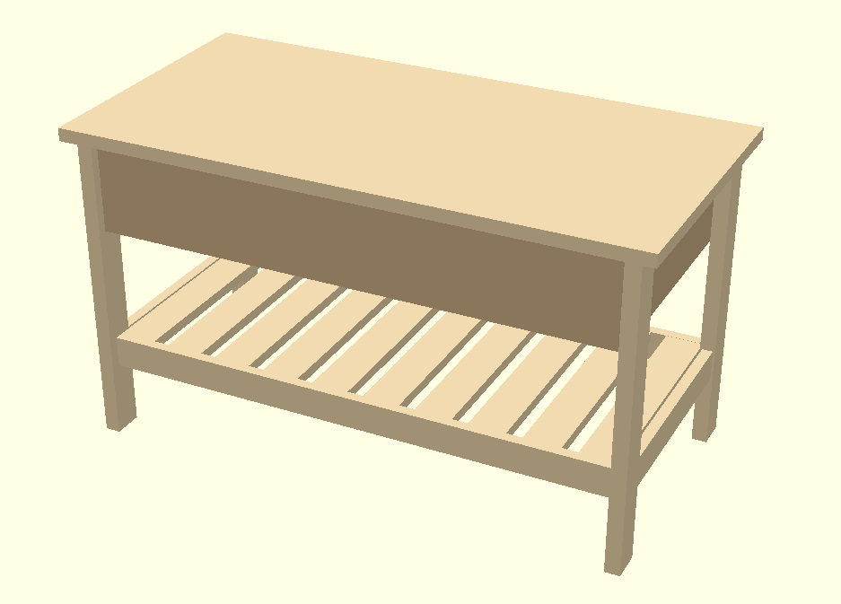

# shoe-bench
Shoe bench with one shelf  and a storige unit for shoe care items. It is made out of tick teak plywood
and solid teak. 

## BOM
* Teak plywood 
* list teak 
- [Bejerbygg: 15x43](https://www.beijerbygg.se/privat/sv/produkter/tr%C3%A4produkter/listverk/planhyvlat-virke/15x43-hyvlad-teak-006976482)

### cutting list 
(<amount>x <name>: <length>x<width>x<height>) (mm)
* 8x Legs: 432x15x43 
* 2x shelfStabaliser front and back: 750x43x15
* 2x shelfStabaliser left and right: 274x43x15
* 10x shelfLists: 302x52x14
* 2X storage front and back: 750x128x18
* 2X storage left and right: 298x128x18
* 1x storageBottom: 714x298x18
* 1x lid: 800x400x18

## Instructions
* Start with the storage unit and glue it using pluggs.
* glue the legs
* plugg the and assable the legs with the storage unit.
* Messure the distans between the two legs saw, plugg and assambel the shelfstabaliseres.
* Mesure the distens between the stabalaser and saw all the shelf lists.
  raout a grove on the front and back stabalaser to fit the shellf lists.
  make a mall that can be but in betwn eatch shelf list. 
* Glue and assamble everyting exept the the shelf lists.
* Glue all shelf lists
